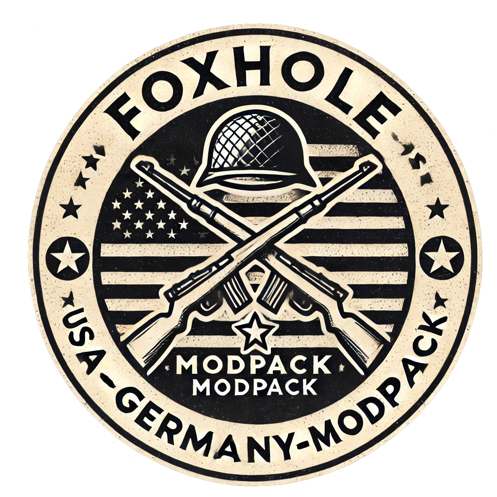

### **<h1 align="center">Foxhole-USA-GERMANY-Modpack</h1>**

  

## Description

I have created a modpack (zip file) containing all the mods I use for Foxhole. All mods are up-to-date and fully compatible. I recommend downloading the full pack, launching the game, and removing any mods you do not wish to use.

Alternatively, you can review the list of included mods in the [ModPack Contents](#modpack-contents) section and click on any specific mod you are interested in to be redirected to its respective page.

<!-- Alternatively, you can download the files divided into categories. However, this approach is less intuitive as it may be harder to understand the function of each file. (**Note: These category files are outdated for now, do not use**).

Another option is to review the list of included mods in the first comments of the post and click on any specific mod you are interested in to be redirected to its respective page. -->

## Complete ModPack (v1.2)
**Download here:**
<a href="https://drive.google.com/file/d/12xMKNTcYYfXOtQ03mqKk0KITDkFow0LD/view?usp=drive_link" target="_blank">Download Link</a>

<!-- ## By Categories (Outdated)

### Utilities:
[Download Link](https://drive.google.com/file/d/137X8eCT39pwKnSrGPsarN7CvG__CvFuv/view?usp=drive_link)

### Vehicles:
[Download Link](https://drive.google.com/file/d/139G5tvWvsYWiYwrRk_px9ebqc-WgkGnM/view?usp=drive_link)

### Uniforms:
[Download Link](https://drive.google.com/file/d/13EnUm8wTJStisW2NLK_rsgZ3xuxBUgOJ/view?usp=drive_link)

### Flags:
[Download Link](https://drive.google.com/file/d/13CWzjyZ5F3REaHFmLcSl7ayMJrR2nd1J/view?usp=drive_link)

### Weapons:
[Download Link](https://drive.google.com/file/d/13GKnOy3kNwC0708uyON6Ue-4kKF_eG3K/view?usp=drive_link) -->

## Important:
Do **not** delete the **'War-WindowsNoEditor.pak'** file from your **Paks** folder, as it is a core game file.

## Installation Instructions:
1. Download the zip file.
2. Extract it to: **"C:\Program Files (x86)\Steam\steamapps\common\Foxhole\War\Content\Paks"**. (Do not create subfolders; place all files directly in the **Paks** folder.)
3. Remove any mods you do not wish to use.

## Screenshots
The images included here provide a preview of how the modpack appears at the time of creation. (This may change with future updates.)

*To add later.*
## ModPack Contents:

### Utilities:
- **Sound:**
  - [Skaj's super uber-fantastical Foxhole sound mod](https://skaj999.itch.io/super-uber-fantastical-foxhole-sound-mod) (Improved sounds) [skaj]
  - [Soundpack from Sev](https://www.nexusmods.com/foxhole/mods/102) [sev]
  - [Metal Pipe Vehicle Destruction Sound](https://goliaten.itch.io/foxhole-metal-pipe-vehicle-destruction-sound) [Goliaten]
- **Map:**
  - [ImprovedMapMode KnightofScience Edit](https://knight-of-science.itch.io/improved-map-mod-kos-edit) (Enhanced map) [Knight of Science]
  - [GoblinGreen & SimpleRed](https://ceeps.itch.io/chadblue-simplered-ui) (Better green icons for Colonials and red for Wardens) [Ceeps]
  - [New Large Ship Icon](https://dkov.itch.io/foxhole-new-large-ship-icon) [DKoV]
  - [Resource Mines/Fields Recolored](https://muki47.itch.io/foxhole-resource-minesfields-recolored) [Muki47]
  - [BB Tiers](https://nautilusd.itch.io/bb-tiers) (Visible bunker tiers on the map) [nautilusd]
- **HUD:**
  - [Colorful Crosshairs](https://ceeps.itch.io/colorful-crosshairs) (Colored crosshair, yellow in this pack) [Ceeps]
  - [Advanced Bars](https://www.nexusmods.com/foxhole/mods/29) (Stamina and fuel bar with separators every 10%) [DustAve & KOCMOHABT]
  - [BetterCompass](https://www.nexusmods.com/foxhole/mods/27) (Enhanced, detailed compass) [KOCMOHABT]
  - [New Icons Mod](https://rainbowbu.itch.io/new-icons-modfoxhole) (Colored items) [Bu]
  - [Text Chat Recolor](https://www.nexusmods.com/foxhole/mods/127) (Improved chat with white content) [patripastry]
  - [Remove Dirt Mask Overlay](https://wowitsafox.itch.io/foxhole-remove-dirt-mask-overlay) (to test...) [Foxy ♥]
- **Visuals:**
  - [Striped Shells Retexture](https://www.nexusmods.com/foxhole/mods/105) (Color-coded shells for easier identification) [mailbock]
  - [Red Tracers](https://foxholeenjoyer.itch.io/redtracers) [foxholeenjoyer]
  - [Real Trak](https://discord.com/channels/344477723495759876/1042250271281127425/1090921702613073980) (Improved rails with reflections) [?]

### Vehicles:
- **Both factions:**
  - [Better Fuel Trucks](https://discord.com/channels/344477723495759876/1042250271281127425/1100476939648630804) [?]
  - [Flatbed](https://www.nexusmods.com/foxhole/mods/52) [WolfgangIX] + [Yellow Texture](https://discord.com/channels/867256068475977748/1283097872790851687/1283097872790851687) [Autumn]
  - [Battle Bus Mod](https://danetello.itch.io/foxhole-battle-bus-mod) [Danetello]
- **Colonial:**
  - [US Army Vehicles](https://www.nexusmods.com/foxhole/mods/35) (Textures for most colonial vehicles before changing skins on some of them) [kromgar1]
  - [Imported WWII Vehicles](https://www.nexusmods.com/foxhole/mods/87) (Hatchet, Kraneska, Bardiche) [WolfgangIX]
  - [Field Gun: 120-68 “Koronides” / Field Gun, 945g “Stygian Bolt”](https://www.nexusmods.com/foxhole/mods/52) [WolfgangIX]
  - [US WW2 Full Conversion](https://discord.com/channels/867256068475977748/1222946596241539112/1236724193463242792) [LunaMoth171 & WolfgangIX]
  - [AC - Bee | AC - Abelha Skin](https://thgomez.itch.io/ac-bee-ubge-doctrine-skin) [thgomez]
- **Warden:**
  - [German Vehicles](https://www.nexusmods.com/foxhole/mods/45) (Textures for most warden vehicles before changing skins on some of them) [kromgar1]
  - [WW2 German Vehicle Remodel](https://www.nexusmods.com/foxhole/mods/111) [Stitch]
  - [Hanomag Halftrack Remodel](https://suyanto.itch.io/foxhole-hanomag-halftrack-remodel) [Suyanto]

### Uniforms:
- **Colonial:**
  - [The World War 2 Collection - USA](https://www.nexusmods.com/foxhole/mods/39) [WolfgangIX]
  - [The World War 2 Collection - US Paratrooper](https://www.nexusmods.com/foxhole/mods/50) (Soldier & Recon) [WolfgangIX]
  - [WW2 US Army Patches](https://tnvalleycbrn.itch.io/ww2-us-army-patches) [TNvalleyCBRN]
- **Warden:**
  - [The World War 2 Collections - German](https://www.nexusmods.com/foxhole/mods/40) [WolfgangIX]
  - [WW2 German Decals and Camo](https://www.nexusmods.com/foxhole/mods/53) [WolfgangIX & Balk & TNvalleyCBRN]

### Flags:
- [Western Front Flags](https://www.nexusmods.com/foxhole/mods/45) (US vs Germany) [kromgar1]

### Weapons:
- **Colonial:**
  - [M1 Garand (Argenti)](https://britempire09.itch.io/m1-garand-for-argenti) [BritEmpire09]
  - [Thompson (Pitch Gun)](https://britempire09.itch.io/thompson-m1928a1-for-pitch-gun) [BritEmpire09]
  - [Drum Thompson (Dusk)](https://britempire09.itch.io/drum) [BritEmpire09]
  - [Lee Metford (Volta)](https://britempire09.itch.io/lee-metford-rifle-for-volta) [BritEmpire09]
  - [Lewis Gun (Catara)](https://britempire09.itch.io/lewis-gun-alt-version-for-catara) [BritEmpire09]
  - [M1A1 (Fuscina)](https://britempire09.itch.io/m1a1) [BritEmpire09]
  - [M1903 (Omen)](https://britempire09.itch.io/m1903-for-omen) [BritEmpire09]
  - [M1903 Scoped (Auger)](https://britempire09.itch.io/m1903-scoped-for-auger) [BritEmpire09]
  - [M2 Browning 50 cal (Lamentum)](https://britempire09.itch.io/50cal-for-collie-tripod-mg) [BritEmpire09]
- **Warden:**
  - [MP40 (Fiddler)](https://britempire09.itch.io/mp40-for-fiddler) [BritEmpire09]
  - [Mosin Nagan (Laughcaster)](https://britempire09.itch.io/waw-mosin-for-loughcaster) [BritEmpire09]
  - [G98 (Cinder)](https://britempire09.itch.io/g98-for-clancy-cinder) [BritEmpire09]
  - [MG42 (Malone)](https://britempire09.itch.io/mg42-redux-for-malone) [BritEmpire09]
  - [Ross Rifle (Hangman)](https://britempire09.itch.io/ross-rifle-for-hangman) [BritEmpire09]
  - [MP28 (Liar)](https://britempire09.itch.io/mp28-for-liar) [BritEmpire09]
  - [Trench Gun (Shotgun)](https://britempire09.itch.io/trenchgun-for-shotgun) [BritEmpire09]
  - [Panzerschreck (Cutler)](https://okidoooke.itch.io/world-war-ii-infantry-weapons) [okidooke]

## Optional Contents:
Not included in the modpack !

### Utilities:
- [Tanker Sound Callouts](https://saul-mangood.itch.io/tanker-callouts) [Saul_ManGood]
- [UI Styles](https://ceeps.itch.io/foxhole-ui-styles) (I want to add RedStatic-Warden from that mod but can't find it...) [Ceeps]
- [Weapons Stats](https://discord.com/channels/867256068475977748/1200427677652365363/1200427677652365363) (Displays weapon stats in the inventory description but doesn't seem up to date) [blackout]
- [Santa Hat](https://nautilusd.itch.io/santa-hat) (Does not work with uniform skins) [nautilusd]
- [Mud & Blood](https://biackout.itch.io/shit-grenade-private-throw-it-back-now) (Incompatible with uniform skins) [blackout]
- [Better Player Icon](https://j0w00d.itch.io/better-player-icon) (Orange arrow version) [JoWooD]

### Vehicles:
- **Both factions:**
  - [Foxhole Vehicles Overhaul](https://www.nexusmods.com/foxhole/mods/10) [WolfgangIX]
- **Warden:**
  - [French Vehicles](https://www.nexusmods.com/foxhole/mods/38) (Includes optional French/German flags) [kromgar1]
  - [WW1 and WW2 French Vehicle Remodel](https://www.nexusmods.com/foxhole/mods/109) [ErichEgf]
  - [S35 & D2](https://discord.com/channels/867256068475977748/937779375942815825/1255343295689658368) (To try out...) [Stitch]

### Uniforms:
- **Warden:**
  - [Poilus (WWI French)](https://sentsu.itch.io/foxhole-warden-french-ww1-poilus) [Sentsu]
  - [Luftwaffe Faction](https://www.nexusmods.com/foxhole/mods/89) [Kaizer]

### Flags:
- **Warden:**
  - [French Flags](https://www.nexusmods.com/foxhole/mods/69) [Docteur Lulu]
  - [Wolfenstein Flag](https://www.nexusmods.com/foxhole/mods/45) (US vs Germany) [kromgar1]
  - [NATO Flag](https://discord.com/channels/867256068475977748/1191260498948268132/1304585617514037248) [Danetello]

### Weapons:
- **Colonial:**
  - [Wood L1A1 (Argenti)](https://britempire09.itch.io/wood-l1a1-for-argenti) [BritEmpire09]
  - [Sten (Pitch Gun)](https://britempire09.itch.io/sten-for-pitch-gun) [BritEmpire09]
- **Warden:**
  - [WW1 and WW2 French Firearms Remodel](https://www.nexusmods.com/foxhole/mods/110) [ErichEgf]